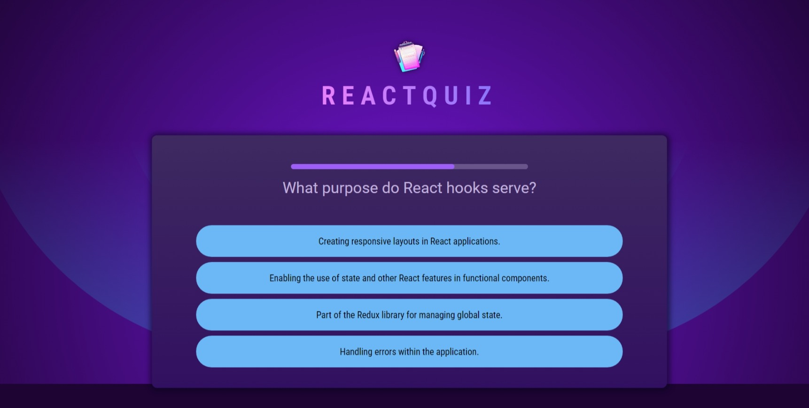
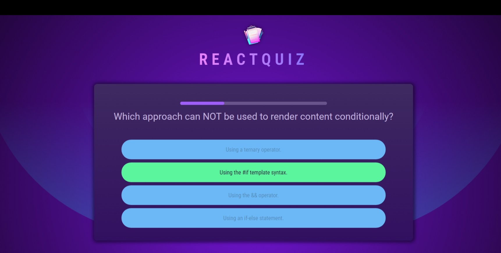

### Quiz Application

Project based on **React.js**, just a basic quiz application.

### Pre Requisites

- **Node.js** version **21** or greater.

### Dependencies used by the project

1. **react**.
2. **react-dom**

### Dev Dependencies used by the project

1. **vite**.

### Instructions

1. Run `npm run dev` command to run the project.

2. Visit `http://localhost:5173/`, this will open the home page that looks like this. 

3. Try answering the questions. 